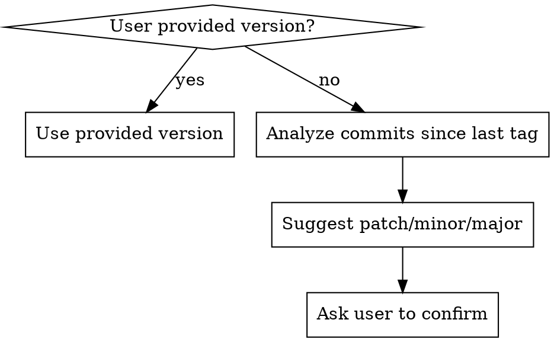

# Release Figment

Automates Figment's release process: version bump, changelog updates, commit, tag, and push. The `v*` tag push triggers GitHub Actions CI which builds signed binaries and uploads to S3.

## Pre-flight Checks

Before anything else, verify the environment is ready:

1. **Branch check**: Must be on `main`. Abort with clear message if not.
2. **Clean working tree**: Run `git status --porcelain`. Abort if there are uncommitted or staged changes.
3. **Current version**: Read `"version"` from `package.json`.
4. **Latest tag**: Run `git describe --tags --abbrev=0` to find the last release tag for the diff range.

If any check fails, stop immediately and tell the user why.

## Version Selection



If the user did not specify a version, suggest one based on commit content and **ask for confirmation**. Do not proceed without explicit user approval.

## Collect Changes

1. Run `git log <last-tag>..HEAD --oneline` to enumerate all commits since the last release.
2. Summarize commits into user-facing changelog bullet points. Focus on what changed for the user, not implementation details. Write in the same style as existing `CHANGES.md` entries (past tense or descriptive, starting with `-`).

## Validate CHANGES.md

Verify that the **previous version's** entry exists in `CHANGES.md`. If the previous version is missing from the changelog, notify the user and **stop** — the changelog history is incomplete.

## Update Files

Update exactly these 4 files:

### 1. `package.json`
Change the `"version"` field to the new version.

### 2. `package-lock.json`
Run `npm install` to sync the lockfile with the new version.

### 3. `CHANGES.md`
Add a new section **at the top** of the file (after the `# CHANGES` heading):
```
## Version X.Y.Z (YYYY-MM-DD)

- Changelog bullet points here
```

### 4. `docs/src/pages/release-notes.md`
Add a matching section **after the YAML frontmatter and `# Release Notes` heading**, before existing version entries:
```
## Version X.Y.Z (YYYY-MM-DD)

- Same changelog bullet points
```

> The download page (`docs/src/components/DownloadPage.jsx`) reads the current version dynamically from S3 manifests (`latest.yml` / `latest-mac.yml`) at runtime. It only advertises a version once that version's binary is actually live on S3, so no manual bump here is needed.

## Pre-commit Verification

Run these checks and fix any issues before committing:

1. `npm test` — all tests must pass
2. `npm run format-check` — if it fails, run `npm run format` and re-check
3. `npm run build` — production build must succeed

If any check fails after remediation, stop and report the issue.

## Review Gate

Before committing, show the user a synopsis:
- **Version**: old -> new
- **Changelog content**: the bullet points that will be added
- **Modified files**: list all 5 files

**Wait for explicit user approval before committing.**

## Commit, Tag, Push

After user approval:

1. Stage the 5 files explicitly: `git add package.json package-lock.json CHANGES.md docs/src/pages/release-notes.md docs/src/components/DownloadPage.jsx`
2. Commit with message: `Version X.Y.Z`
3. Create tag: `git tag vX.Y.Z`
4. Push: `git push && git push --tags`

Do NOT use `git add .` or `git add -A`. Only stage the specific files listed above.
