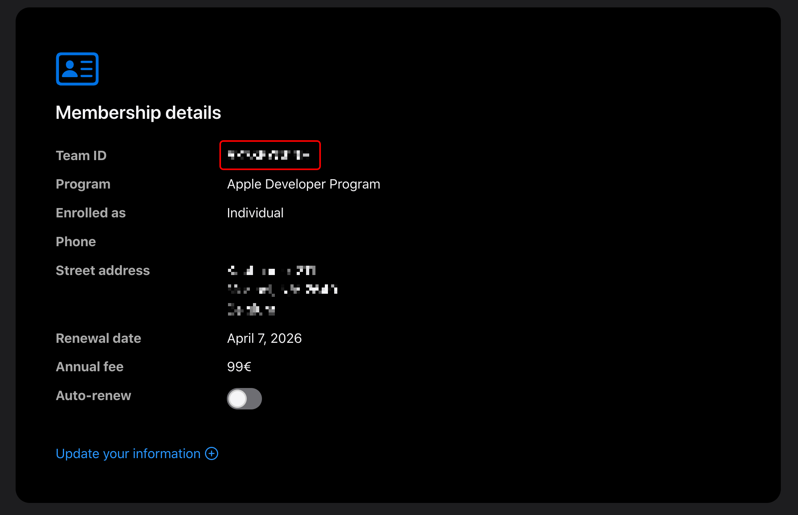
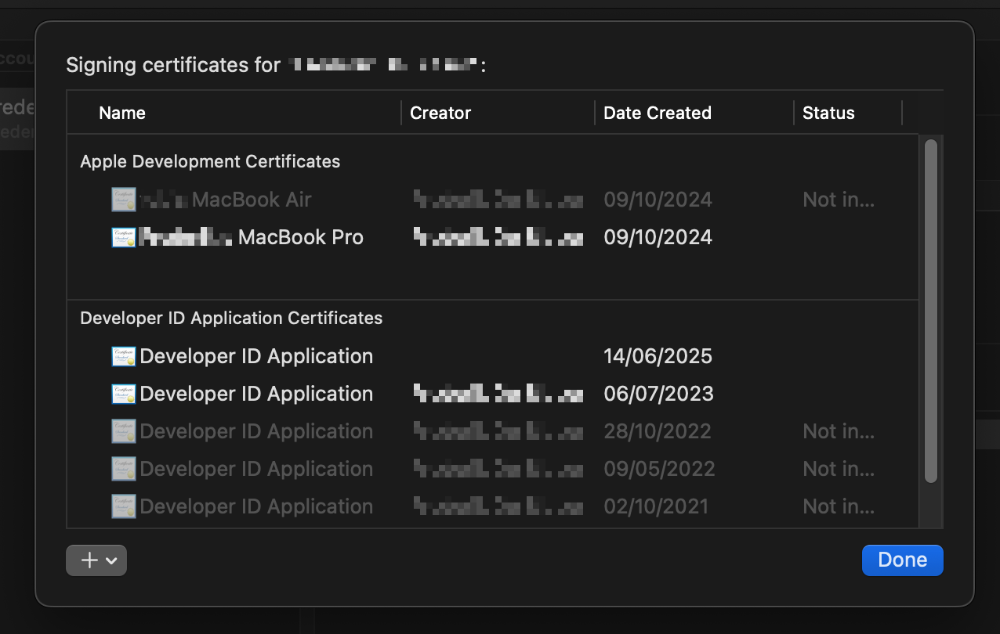
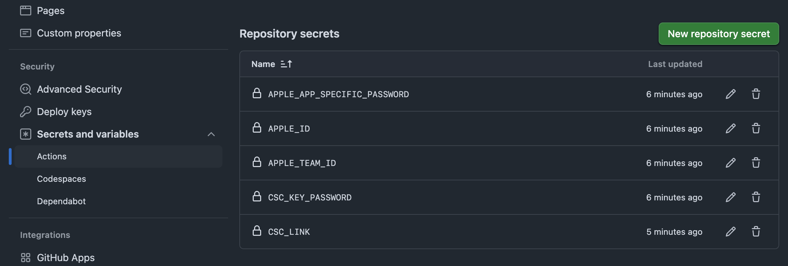

# Code Signing the App

In order to sign and notarize the app on macOS, we need to do several steps:

## Get an Apple app-specific password

Go to your [Apple ID account page](https://appleid.apple.com/) and sign in. Under "Security", find the "App-Specific Passwords" section. Click "Generate Password..." and follow the instructions to create a new app-specific password. You will need this for notarization.

## Get your Apple team ID

Go to your [Apple Developer account](https://developer.apple.com/account) and under "membership details" you should see your Team ID:



## Get out the Developer ID certificate

Install Xcode. Under Preferences > Accounts, click your Apple account and go to Manage Certificates. There you will see a list of signing certificates:



You need to have a Developer ID Application certificate. If you don't have one, you can create it by clicking the "+" button at the bottom left and selecting "Developer ID Application".

Right-click your Developer ID Application certificate and select "Export Certificate". Save it as `DeveloperID.p12` on the Desktop. Generate a random secure password and enter it in the export dialog.

Convert the certificate to base64:

```bash
base64 -i ~/Desktop/DeveloperID.p12 | pbcopy
```

In GitHub, make an environment (under your project settings > Secrets and Variables > Actions), you can set up the following under "Respository secrets":

- `APPLE_ID`: your Apple ID email address.
- `APPLE_APP_SPECIFIC_PASSWORD`: an app-specific password generated from your Apple ID account page. This is used for notarization.
- `APPLE_TEAM_ID`: your Apple Developer account team ID, which you can find in the [Membership section of your Apple Developer account](https://developer.apple.com/account).
- `CSC_LINK`: paste the base64-encoded certificate here, without any newline characters. If you've used `pbcopy`, this should already be correct.
- `CSC_KEY_PASSWORD`: the password you used to export the certificate.



## Configure the GitHub Actions workflow

Look [here](https://github.com/figmentapp/figment/blob/master/.github/workflows/build.yml) for the GitHub Actions workflow that builds the app and signs it. The relevant parts for code signing are:

```yaml
- name: Build Electron app
  run: npm run dist-${{ matrix.os == 'macos-latest' && 'mac' || 'win' }}
  env:
    CSC_LINK: ${{ secrets.CSC_LINK }}
    CSC_KEY_PASSWORD: ${{ secrets.CSC_KEY_PASSWORD }}
    APPLE_ID: ${{ secrets.APPLE_ID }}
    APPLE_APP_SPECIFIC_PASSWORD: ${{ secrets.APPLE_APP_SPECIFIC_PASSWORD }}
    APPLE_TEAM_ID: ${{ secrets.APPLE_TEAM_ID }}
    GH_TOKEN: ${{ secrets.GITHUB_TOKEN }}
```
