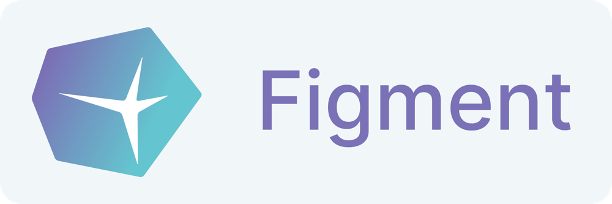
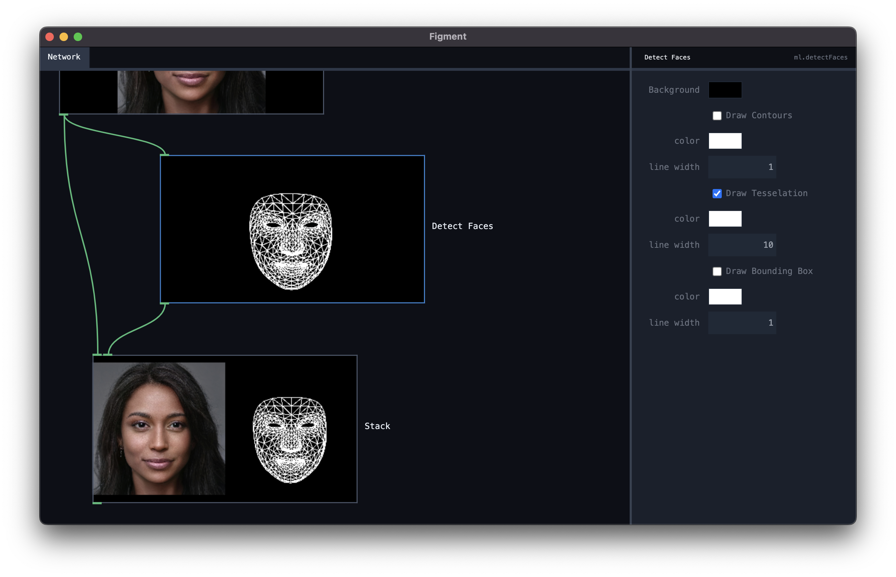

<div align="center">
    <a href="https://www.figmentapp.com/"></a>
    <h3>Figment</h3>
    <p>Data kneading for creative AI</p>
</div>

## About Figment

[](https://www.figmentapp.com/)

Figment is a **graphical node-based app** for preparing data for feeding into creative AI applications. It helps you massage your data into shape. It is well built for handling large datasets, built-in ML tasks, and creative operations.

### Built With

Figment is an [Electron app](https://www.electronjs.org/) written in JavaScript and [React](https://reactjs.org/).

## Getting Started

If you just want to **use Figment**, go to the [download page](https://figmentapp.com/download/) and download the latest release. You might want to read the [tutorial](https://figmentapp.com/docs/tutorials/) as well, and browse through the [node reference](https://figmentapp.com/docs/nodes/).

## Development

If you want to help building or improving Figment, welcome! To get a local copy up and running, do the following:

### Prerequisites

After you've cloned the repository, use npm to install the dependencies:

```
npm install
```

Once you've installed the dependencies, start the app and bundler by running:

```
npm start
```

## Contributing

Contributions are what make the open source community such an amazing place to learn, inspire, and create. Any contributions you make are **greatly appreciated**.

If you have a suggestion that would make this better, please fork the repo and create a pull request. You can also simply open an issue with the tag "enhancement".
Don't forget to give the project a star! Thanks again!

1. Fork the Project
2. Create your Feature Branch (`git checkout -b feature/AmazingFeature`)
3. Commit your Changes (`git commit -m 'Add some AmazingFeature'`)
4. Push to the Branch (`git push origin feature/AmazingFeature`)
5. Open a Pull Request

## License

Distributed under the GPL 2.0 License. See [LICENSE](LICENSE) for more information.

## Contact

Figment is developed as part of [The Algorithmic Gaze](https://algorithmicgaze.com/), the AI research lab at [Sint Lucas School of Arts](https://sintlucasantwerpen.be/) in Antwerp.

- Frederik De Bleser — frederik.debleser@kdg.be
- Lieven Menschaert — lieven.menschaert@kdg.be
- Ine Vanoeveren — ine.vanoeveren@kdg.be